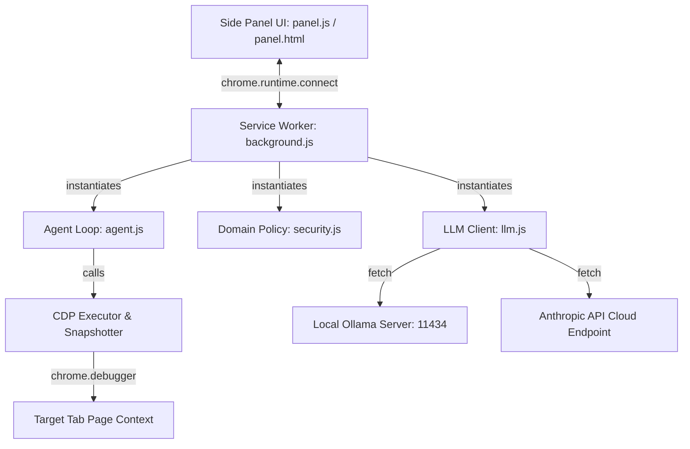

# ⚓ Navy Browser Agent

[](#)
[](https://zrnge.github.io)
[](https://github.com/zrnge/navybrowser)
[](#)
[](#)

Navy is a privacy-first, serverless Chrome Manifest V3 web extension that runs an autonomous browser automation agent loop directly inside your browser's service worker. 

Navy connects directly to local LLMs (like Ollama or llama.cpp) or cloud endpoints (Anthropic Claude API) to automate complex visual and structural tasks—such as clicking, typing, page transitions, keypresses, and custom drag-and-drop actions—completely client-side. No remote orchestrator, server backend, or Python installation is required.

---

## Key Features

- **Pure Browser Extension (MV3)**: 100% JavaScript codebase running completely inside a native background service worker. Load the extension and start automating immediately.
- **Privacy First & Secure**: Includes a robust `DomainPolicy` engine supporting custom domain allowlists, user denylists, and sensitive domain blocks (banks, password managers, healthcare, etc.).
- **Credentials Masking**: Automatically detects password/credentials inputs and masks them using SHA-256 hash digests inside the audit log.
- **Local & Cloud LLMs**: Seamlessly toggle between local Ollama instances (`Qwen2.5`, `minicpm-v:8b`) and Anthropic Claude cloud endpoints directly from the sidebar UI settings.
- **Polished, Claude-Inspired Chat UI**: Features a charcoal base theme with glowing aqua-cyan outlines pulsing around the target viewport to indicate active automation states.
- **Media Control Tips**: Injects custom prompt rules and API helpers for media player actions, enabling the agent to adjust volume (using YouTube player APIs) or speed up playback (2x speed) in a single script step.
- **Polished Input Event Handling**: Support standard keyboard inputs (Enter to send, Shift+Enter for newlines) and immediate Enter key submissions inside permissions dialog inputs.

---

## Architecture



---

## Project Layout

```
navybrowser/
├── extension/                  Chrome MV3 Extension Root
│   ├── manifest.json           Extension metadata & permissions
│   ├── background.js           Service worker & CDP executor interface
│   ├── agent.js                Native planning loop & prompt builder
│   ├── llm.js                  Ollama & Anthropic API clients
│   ├── security.js             DomainPolicy & AuditLogger
│   └── ui/
│       ├── panel.html          Sidebar layout & Settings Drawer
│       ├── panel.css           Theme colors, keyframes, & dropdowns
│       ├── panel.js            Sidebar event listeners & timeline builder
│       └── icon{16,48,128}.png Resized ship's anchor theme icons
└── README.md                   This documentation
```

---

## Quick Start (Chrome Extension Setup)

### 1. Load the Extension
1. Open Google Chrome and navigate to `chrome://extensions`.
2. Enable **Developer mode** using the toggle switch in the top-right corner.
3. Click **Load unpacked** (top-left) and select the `extension/` folder inside this repository.
4. The **Navy** anchor icon will appear in your extensions list.

### 2. Configure Your LLM & Environment Variables
1. Click the Navy anchor icon in the toolbar or open it via the Side Panel dropdown.
2. Click the gear icon (**⚙**) in the top-right corner to open **Agent Settings**.
3. Configure your endpoint:
   - **Local Ollama (Offline)**: Keep the default URL (`http://127.0.0.1:11434/v1`) or point to llama.cpp. Ensure `ollama serve` is running in your terminal.
   - **Cloud Claude (Recommended)**: Paste your Anthropic API Key (e.g. `sk-ant-...`) in the API Key input.
4. Click **Save Settings**.

#### Setting Terminal Environment Variables (All OS)
To connect the Chrome extension to a local Ollama server, you must configure Cross-Origin Resource Sharing (CORS) by setting the `OLLAMA_ORIGINS` environment variable before running Ollama:

##### 💻 Windows (PowerShell)
* **Temporary (Current terminal only)**:
  ```powershell
  $env:OLLAMA_ORIGINS="chrome-extension://*"
  ollama serve
  ```
* **Permanent (User environment)**:
  ```powershell
  [System.Environment]::SetEnvironmentVariable("OLLAMA_ORIGINS", "chrome-extension://*", "User")
  # Restart PowerShell/Ollama for the changes to take effect
  ```

##### 💻 Windows (Command Prompt - CMD)
* **Temporary (Current command prompt only)**:
  ```cmd
  set OLLAMA_ORIGINS=chrome-extension://*
  ollama serve
  ```
* **Permanent**:
  ```cmd
  setx OLLAMA_ORIGINS "chrome-extension://*"
  # Restart CMD/Ollama for the changes to take effect
  ```

##### 🍎 macOS & 🐧 Linux (Bash / Zsh)
* **Temporary (Current terminal only)**:
  ```bash
  export OLLAMA_ORIGINS="chrome-extension://*"
  ollama serve
  ```
* **Permanent**:
  Append the export command to your shell configuration file (e.g., `~/.zshrc`, `~/.bashrc`, or `~/.bash_profile`):
  ```bash
  echo 'export OLLAMA_ORIGINS="chrome-extension://*"' >> ~/.zshrc
  source ~/.zshrc
  ```

### 3. Run a Task
1. Navigate to any target website.
2. Open the Navy side panel, type your task in the input text area (e.g. *play a random video and set speed to 2x*), and press **Enter** (or click the arrow button).
3. The browser will attach the CDP debugger and execute the task autonomously! Click the red **Stop** button or press `Ctrl+Shift+.` to cancel at any time.

---

## Policy & Custom Domains

By default, Navy operates on all non-sensitive domains. To restrict or lock down access to specific domains, configure the `allowlist` and `user_denylist` in your sidebar settings or create a policy file. 

Navy restricts access to all credentials-sensitive domains (such as bank portals, healthcare sites, and crypto wallets) automatically; this built-in safety gate cannot be bypassed.

---

## Development

To check code syntax or verify files:
```bash
# Syntax-check the extension JavaScript files
node --check extension/background.js
node --check extension/agent.js
node --check extension/llm.js
node --check extension/security.js
```

---

## Author & Developer

Navy is designed, developed, and maintained by **Zrnge**.
- **Personal Website / Portfolio**: [zrnge.github.io](https://zrnge.github.io)
- **GitHub Repository**: [github.com/zrnge/navybrowser](https://github.com/zrnge/navybrowser)

Feel free to star the repository, open issues, or submit pull requests!

---

## License

This project is licensed under the MIT License. Open source and yours to extend.
