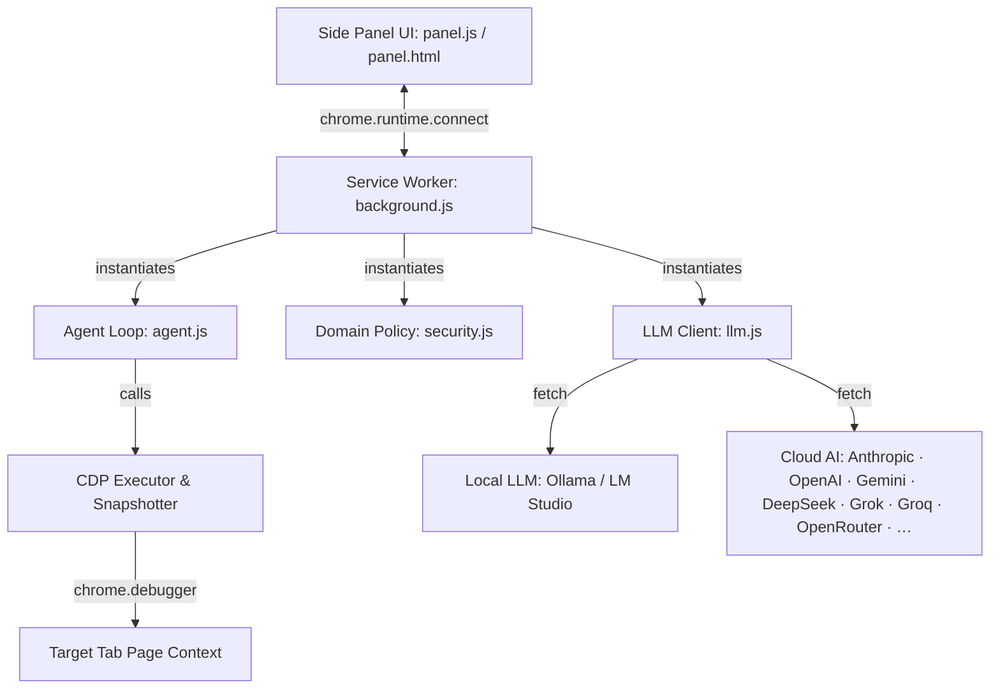

# ⚓ Navy Browser Agent

[](#)
[](https://zrnge.github.io)
[](https://github.com/zrnge/navybrowser)
[](#)
[](#)

Navy is a serverless Chrome Manifest V3 extension that runs an autonomous browser automation agent loop directly inside your browser's service worker.

Navy connects to your chosen AI model — local (Ollama, LM Studio) or cloud (Anthropic Claude, OpenAI, Google Gemini, DeepSeek, xAI Grok, Groq, OpenRouter, and more) — to automate complex visual and interactive tasks: clicking, typing, scrolling, dragging, tab management, form filling, and arbitrary script execution. No remote orchestrator, server backend, or Python installation is required.

**Privacy:** When using Ollama or LM Studio, all processing is local and no data leaves your machine. When using a cloud provider, page content and screenshots are sent to that provider's API to perform the task. Navy's developer never receives any data. See [PRIVACY.md](PRIVACY.md) for full details.

---

## Key Features

- **Pure Browser Extension (MV3)**: 100% JavaScript, runs entirely inside a Chrome service worker. Load unpacked and start automating immediately — no install, no backend.
- **12 AI Providers**: Ollama, LM Studio, Anthropic Claude, OpenAI, Google Gemini, DeepSeek, xAI Grok, Groq, z.ai, OpenRouter, and any custom OpenAI-compatible endpoint. Swap models without reloading.
- **Uses Your Own Browser Session**: Operates inside your real Chrome profile — your existing cookies, logins, and saved state are available to every task.
- **Rich Action Set**: Click, double-click, right-click, type, scroll, drag, hover, key combos, select, fetch (HTTP calls from page context), script (arbitrary JS), batch, tab management, audio transcription, and more.
- **Two-Tier Planning Loop**: Decomposes goals into subtasks, executes step-by-step with screenshot + accessibility tree reasoning, and re-plans dynamically when stuck.
- **Domain Policy & Credentials Masking**: Built-in block list for banking and identity sites. Password fields and credential-like inputs are SHA-256 hashed before appearing in audit logs.
- **CAPTCHA Handling**: Attempts image CAPTCHAs visually, audio CAPTCHAs via tab audio transcription, and checkbox CAPTCHAs autonomously.
- **Panic Stop**: `Ctrl+Shift+.` (or `Cmd+Shift+.`) immediately aborts any running task.

---

## Architecture



---

## Project Layout

```
navybrowser/
├── extension/                  Chrome MV3 Extension Root
│   ├── manifest.json           Extension metadata & permissions
│   ├── background.js           Service worker, CDP executor & action handlers
│   ├── agent.js                Planning loop, system prompts & world state
│   ├── llm.js                  Multi-provider LLM client (12 providers)
│   ├── security.js             DomainPolicy, AuditLogger & injection detection
│   ├── offscreen.html          Offscreen document for tab audio capture
│   ├── offscreen.js            MediaRecorder bridge for the listen action
│   └── ui/
│       ├── panel.html          Sidebar layout & Settings Drawer
│       ├── panel.css           Theme colors, keyframes & dropdowns
│       ├── panel.js            Sidebar event listeners & timeline builder
│       └── icon{16,48,128}.png Ship's anchor icons
├── PRIVACY.md                  Privacy policy
└── README.md                   This documentation
```

---

## Quick Start (Chrome Extension Setup)

### 1. Load the Extension
1. Open Google Chrome and navigate to `chrome://extensions`.
2. Enable **Developer mode** using the toggle switch in the top-right corner.
3. Click **Load unpacked** (top-left) and select the `extension/` folder inside this repository.
4. The **Navy** anchor icon will appear in your extensions list.

### 2. Configure Your AI Provider
1. Click the Navy anchor icon in the toolbar or open it via the Side Panel dropdown.
2. Click the gear icon (**⚙**) in the top-right corner to open **Agent Settings**.
3. Select a provider and configure it:
   - **Ollama (fully local, free)**: Keep the default URL (`http://127.0.0.1:11434/v1`). Ensure `ollama serve` is running. No API key needed.
   - **LM Studio (fully local, free)**: Set the URL to `http://127.0.0.1:1234/v1`. No API key needed.
   - **Anthropic Claude**: Select "Anthropic Claude" and paste your `sk-ant-...` API key.
   - **OpenAI / ChatGPT**: Select "OpenAI" and paste your `sk-...` API key.
   - **Google Gemini, DeepSeek, xAI Grok, Groq, OpenRouter**: Select the provider and paste the corresponding API key.
   - **Custom endpoint**: Enter any OpenAI-compatible base URL.
4. Click **Save Settings**.

> **Privacy note:** Ollama and LM Studio keep all data on your machine. Cloud providers receive page content and screenshots as part of the task. See [PRIVACY.md](PRIVACY.md).

#### Setting Terminal Environment Variables (All OS)
To connect the Chrome extension to a local Ollama server, you must configure Cross-Origin Resource Sharing (CORS) by setting the `OLLAMA_ORIGINS` environment variable before running Ollama:

##### 💻 Windows (PowerShell)
* **Temporary (Current terminal only)**:
  ```powershell
  $env:OLLAMA_ORIGINS="chrome-extension://*"
  ollama serve
  ```
* **Permanent (User environment)**:
  ```powershell
  [System.Environment]::SetEnvironmentVariable("OLLAMA_ORIGINS", "chrome-extension://*", "User")
  # Restart PowerShell/Ollama for the changes to take effect
  ```

##### 💻 Windows (Command Prompt - CMD)
* **Temporary (Current command prompt only)**:
  ```cmd
  set OLLAMA_ORIGINS=chrome-extension://*
  ollama serve
  ```
* **Permanent**:
  ```cmd
  setx OLLAMA_ORIGINS "chrome-extension://*"
  # Restart CMD/Ollama for the changes to take effect
  ```

##### 🍎 macOS & 🐧 Linux (Bash / Zsh)
* **Temporary (Current terminal only)**:
  ```bash
  export OLLAMA_ORIGINS="chrome-extension://*"
  ollama serve
  ```
* **Permanent**:
  Append the export command to your shell configuration file (e.g., `~/.zshrc`, `~/.bashrc`, or `~/.bash_profile`):
  ```bash
  echo 'export OLLAMA_ORIGINS="chrome-extension://*"' >> ~/.zshrc
  source ~/.zshrc
  ```

### 3. Run a Task
1. Navigate to any target website.
2. Open the Navy side panel, type your task in the input text area (e.g. *play a random video and set speed to 2x*), and press **Enter** (or click the arrow button).
3. The browser will attach the CDP debugger and execute the task autonomously! Click the red **Stop** button or press `Ctrl+Shift+.` to cancel at any time.

---

## Policy & Custom Domains

By default, Navy operates on all non-sensitive domains. To restrict or lock down access to specific domains, configure the `allowlist` and `user_denylist` in your sidebar settings or create a policy file. 

Navy restricts access to all credentials-sensitive domains (such as bank portals, healthcare sites, and crypto wallets) automatically; this built-in safety gate cannot be bypassed.

---

## Development

To check code syntax or verify files:
```bash
# Syntax-check the extension JavaScript files
node --check extension/background.js
node --check extension/agent.js
node --check extension/llm.js
node --check extension/security.js
```

---

## Author & Developer

Navy is designed, developed, and maintained by **Zrnge**.
- **Personal Website / Portfolio**: [zrnge.github.io](https://zrnge.github.io)
- **GitHub Repository**: [github.com/zrnge/navybrowser](https://github.com/zrnge/navybrowser)
- **Privacy Policy**: [PRIVACY.md](PRIVACY.md)

Feel free to star the repository, open issues, or submit pull requests!

---

## License

This project is licensed under the MIT License. Open source and yours to extend.
